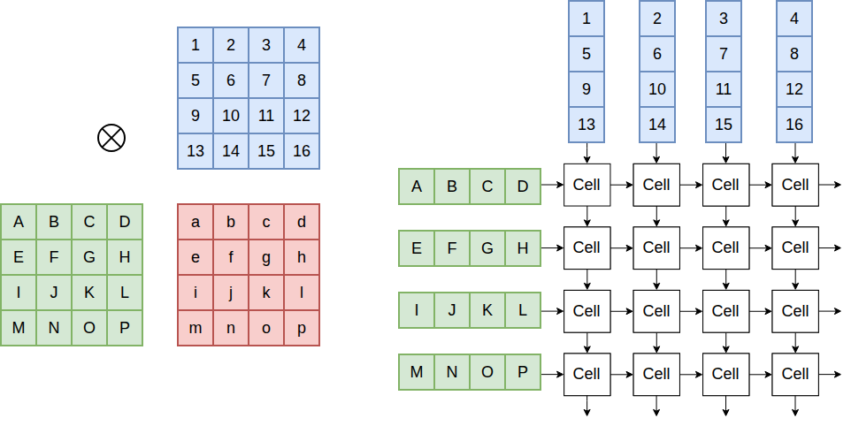
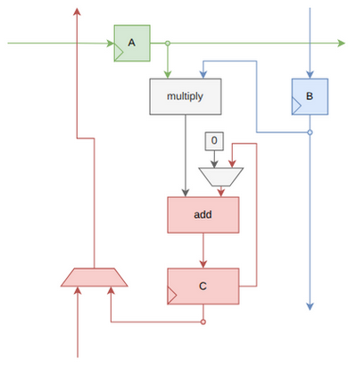
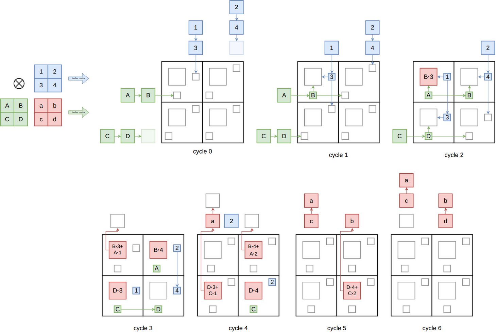
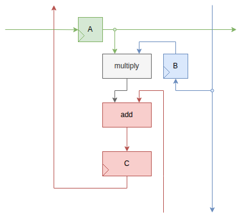
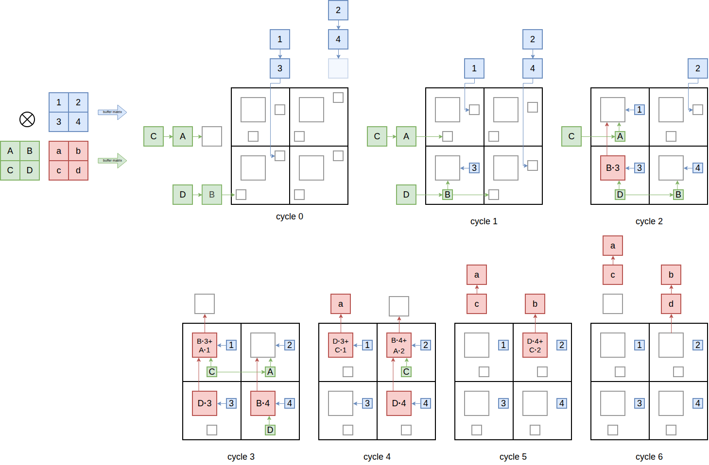

Systolic arrays are a hardware architecture for efficiently performing matrix
multiplications.  They consist of a grid of processing elements, with each
element multiplying two values and adding the result into an accumulated sum.

The two dataflow organizations considered here are
sum-stationary, where the sum remains in the same processing element while the
multiplicands stream past, and weight-stationary, where one of the multiplicands
stays stationary while the other multiplicand and the sum stream past.

In this post I'm going to describe how these two types of systolic arrays are
implemented, explain how data flows differently through them, and compare their
chip area and power consumption using open-source ASIC design
tools.

Sum-Stationary
--------------



In a sum-stationary systolic array the 2D grid of cells in the systolic array
exactly maps to the 2D grid of matrix elements in the result matrix.  We stream
each column of the blue matrix through the corresponding column of the systolic
array.  At the same time we stream each row of the green matrix through the
corresponding row of the systolic array.  In this way cell `(i, j)` of the
systolic array receives row `i` of the green matrix and column `j` of the blue
matrix, and can thus multiply and accumulate the elements together to get
element `(i, j)` of the result matrix.  The details of exactly how this works will
be explained below.

In the next diagram a single cell is shown for a sum-stationary systolic array.
The two multiplicands are labelled A and B and are stored in registers.  Every
cycle A and B are multiplied together and then added to C. The result is then
stored back to the C register.



Below we show how four of these cells are combined to form a systolic array, and
how data flows through the array during a matrix multiplication.  Each cell is
represented as a box containing three smaller boxes, one for each of the three
registers in the cell.

We see the blue matrix and the green matrix being multiplied together to
produce the red result.  The blue matrix is fed into the upper edge of the
array, while the green matrix is fed into the left edge of the array.



The contents of the upper-left cell are updated as follows:

| Cycle | Upper-Left Cell Events |
|-------|------------------------|
|  0    | Value 3 from the blue matrix is sent into the array.<br>Value B from the green matrix is sent into the array. |
|  1    | Values 3 and B are stored in the multiplicand registers. During this cycle they are multiplied together and will be used to update the content of the sum register.<br>The values 1 and A arrive and update the multiplicand registers. |
|  2    | The content of the sum register is B⋅3.  The values 1 and A are multiplied together, added to B⋅3, and used to update the content of the sum register. |
|  3    | The content of the sum register is B⋅3 + 1⋅A.  This value is output through the upper edge of the array. |


Weight-Stationary
-----------------

A weight-stationary cell is shown below.



It is different from the sum-stationary cell in two ways:

**1)** The sum arrives on the bottom edge of the cell.  It is updated and written to the sum register.  On the next cycle, it
   is output on the top edge of the cell.

**2)** The multiplicand B register is updated from a pass-through wire.


Although the cell is fairly similar to that used in the sum-stationary systolic
array, the dataflow pattern is quite different.  The blue matrix entries are
directly written into the multiplicand registers, and are then stationary
(hence the weight-stationary name).  The green matrix is streamed through the
array along the same paths; however, it is transposed relative to how it is sent
through the sum-stationary design.



Power and Area Metrics
----------------------

Sum-stationary and weight-stationary RTL designs were created using 8-bit multiplicands
and 32-bit sums.  A pipeline stage was added between the multiplier and adder to achieve
reasonable frequencies.

**ASAP7 results**

| Design            | Grid Size | Period | Target Util | Cell area |  Power   |
|-------------------|-----------|--------|-------------|-----------|----------|
| weight-stationary |  2x2      | 1.2 ns | 60%         |   437 µm² |  3.0 mW |
| sum-stationary    |  2x2      | 1.2 ns | 60%         |   461 µm² |  3.5 mW |
| weight-stationary |  4x4      | 1.2 ns | 60%         |  1660 µm² |  9.6 mW |
| sum-stationary    |  4x4      | 1.2 ns | 60%         |  1766 µm² | 12.7 mW |

**Sky130 results**

| Design            | Grid Size | Period | Target Util |  Cell area | Power   |
|-------------------|-----------|--------|-------------|------------|---------|
| weight-stationary |  2x2      | 12 ns  | 60%         |  35500 µm² |  8.4 mW |
| sum-stationary    |  2x2      | 12 ns  | 60%         |  38100 µm² | 10.6 mW |
| weight-stationary |  4x4      | 12 ns  | 60%         | 135600 µm² | 27.1 mW |
| sum-stationary    |  4x4      | 12 ns  | 60%         | 144900 µm² | 36.0 mW |

The designs were run through LibreLane (an open-source ASIC tool flow) for
designs with 2x2 grids of cells and designs with 4x4 grids of cells.  They were
run with two PDKs: Sky130 and ASAP7. A PDK is the model of the fabrication
process that is used to design the chip. Sky130 is a PDK for a 130 nm process
from around 2002. ASAP7 is a predictive PDK for a fictional 7nm process from
2016.  The advantage of using two PDKs from different eras is that we can see how
robust the trends are to changes in the process.  Clock periods of 1.2 ns and
12 ns were used, which are slightly larger than the periods at which closing
timing becomes difficult.  Similarly, a cell utilization of 60% is slightly
below the utilization at which routing becomes difficult.  The power was measured
during steady-state multiplication of many matrices in a pipelined manner (one matrix
multiplication every 2 cycles for the 2x2 grid, and one matrix multiplication every 4 cycles for the
4x4 grid).  The precise area and power numbers will strongly depend on the details of
the flow configuration I used, but I hope that the comparison between
sum-stationary and weight-stationary is fairly immune to this.

The weight-stationary design clearly has a lower area and power.  Very roughly
we can say that the weight-stationary has something like 5% lower area and 25%
lower power consumption.  This is due to the additional two muxes required by
the sum-stationary design: one to select whether the new sum will include the
old sum (or whether we are starting a fresh matrix multiplication) and one to
select whether we are outputting the current sum register onto the output bus.

Frequency and Congestion
------------------------

It's also worth looking at whether the maximum obtainable frequency and the maximum obtainable
cell utilization are different for the two designs.

**sky130 PDK, 4x4 grid, 60% target util**

|  Clock Period | sum-stationary       | weight-stationary       |
|---------------|----------------------|-------------------------|
|   12 ns       | PASSED               | PASSED                  |
|   11 ns       | PASSED               | PASSED                  |
|   10 ns       | PASSED               | PASSED                  |
|   9.5 ns      | WNS = -0.019 ns      | PASSED                  |
|   9.0 ns      | WNS = -0.541 ns      | WNS = -0.086 ns         |
|   8.5 ns      | WNS = -1.295 ns      | WNS = -0.592 ns         |

The weight-stationary design is able to go to slightly higher frequencies in
this test.  Because the input sum for the weight-stationary design comes from a
neighboring cell, I expected this to have a negative impact; however, that does
not seem to be the case.

**Sky130 PDK, 4x4 grid, 12 ns clock period**

| Target Util    | Final Util | sum-stationary       | weight-stationary       |
|----------------|------------|----------------------|-------------------------|
|   68%          | 81 %       | PASSED               | PASSED                  |
|   70%          | 83 %       | WNS = -1.009 ns + cap/slew violations     | PASSED        |
|   72%          | 85 %       | WNS = -1.752 ns + cap/slew violations     | PASSED        |
|   74%          | 87 %       | Failed to route     | WNS = -0.758 ns + cap/slew violations |

The sum-stationary design hits congestion at lower target utilizations than the
weight-stationary design.

Operand and Result Reuse
------------------------

One of the biggest differences between the sum-stationary and weight-stationary designs is how easy it is to
reuse an operand or the result in the next matrix multiplication.

**Sum-Stationary**

If we want to do `A = B*C`, followed by `G = A + D*E`, then the sum-stationary approach has a clear advantage.  Rather
than outputting the accumulated sum, `A`, we can just leave it in the systolic array and add the result of the next
matrix multiplication directly on top of it.

**Weight-Stationary**

Alternatively, if we want to do `A = B*C`, followed by `D = B*E`, then the weight-stationary approach has a clear advantage.
We can just leave the `B` matrix in the systolic array to be reused during the second multiplication.

Summary
-------

| Design            | Area          | Power           | Timing  | Congestion         | Value Reuse          |
|-------------------|---------------|-----------------|---------|--------------------|----------------------|
| sum-stationary    |               |                 |                 |                    | Easy reuse of sum    |
| weight-stationary | ~5% less area | ~25% less power | Slightly faster | Slightly less      | Easy reuse of weight |

I am quite surprised that the power consumption difference was this big.  Unless
the reuse of the sum value is important, it seems that a weight-stationary
systolic array is the right choice.

The motivation for this post was that I'm trying to work out the best way to incorporate a distributed systolic array
into my experimental vector processing unit ([zamlet](https://github.com/benreynwar/zamlet)), and wanted to experiment a bit
with standard systolic arrays to compare with the distributed approach.  I'm planning on writing up another note on how
the distributed approach looks soon.

Reproduction
------------

The data for this post was generated from the [zamlet project](https://github.com/benreynwar/zamlet).

Install Nix, then add the FOSSi binary cache to `/etc/nix/nix.conf` (that location assumes a multi-user Linux installation):

```text
extra-experimental-features = nix-command flakes
extra-substituters = https://nix-cache.fossi-foundation.org
extra-trusted-public-keys = nix-cache.fossi-foundation.org:3+K59iFwXqKsL7BNu6Guy0v+uTlwsxYQxjspXzqLYQs=
```

Clone the repo and start the nix shell:

```sh
git clone https://github.com/benreynwar/zamlet.git
cd zamlet
git checkout c6aee291
nix-shell
```

The Nix environment automatically fetches the pinned LibreLane, ASAP7, and Sky130 sources.

Generate the results:

```
bazel build //dse/systolic_array_note:results
```
